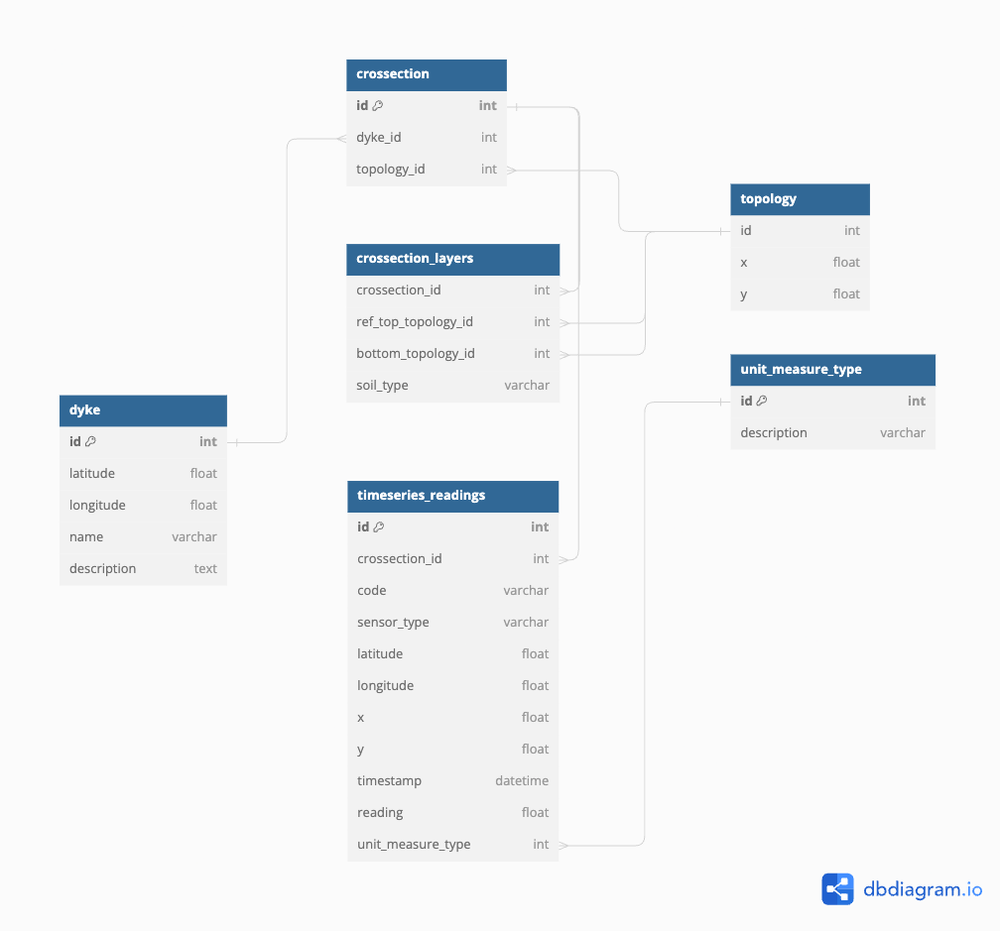

# Database design
Here you can see the latest database design version


You can reproduce the design in diagramdb.io by copy pasting this code:

```
// Describes the units of measurement used in data collection
Table unit_measure_type {
  id int [pk, increment] // primary key
  description varchar
  note: 'Provides a standardized description of units. Independent entity.'
}

// Represents the main structural entity being monitored
Table dyke {
  id int [pk, increment] // primary key
  latitude float
  longitude float
  name varchar
  description text
  note: 'Core entity representing a dyke. Dependent on a geographical location.'
}

// Represents the cross-section of a dyke, linking it to its geometric definition
Table crossection {
  id int [pk, increment] // primary key
  dyke_id int [ref: > dyke.id]
  topology_id int [ref: > topology.id]
  note: 'Defines a specific cross-section of a dyke, associating it with its physical and topological details. Dependent on dyke and topology.'
}

// Junction table for crossections and soil layers, managing many-to-many relationships
Table crossection_layers {
  crossection_id int [ref: > crossection.id]
  ref_top_topology_id int [ref: > topology.id]
  bottom_topology_id int [ref: > topology.id]
  soil_type varchar
  note: 'Used to associate multiple soil layers with specific crossections, reflecting the complex structure of dykes.'
}
 
// Junction table for linking time series data to their corresponding readings
Table timeseries_readings {
  id int [pk, increment] // primary key
  crossection_id int [ref: > crossection.id]
  code varchar // A labelm for example <dyke><Crossection> 1.2
  sensor_type varchar [note: 'Type of sensor like temperature, humidity etc.']
  latitude float
  longitude float
  x float [note: 'X coordinate in a Cartesian coordinate system']
  y float [note: 'Y coordinate in a Cartesian coordinate system']
  timestamp datetime
  reading float
  unit_measure_type int [ref: > unit_measure_type.id]
  note: 'Manages many-to-many relationships between time series and their data points for detailed analysis.'
}


// Defines the relationships between topologies and the points that form them
Table topology {
  id int
  // point_id int [ref: > point.id]
  x float [note: 'X coordinate in a Cartesian coordinate system']
  y float [note: 'Y coordinate in a Cartesian coordinate system']
  note: 'Connects a topology to multiple points, defining the physical shape of an entity like a dyke’s cross-section.'
}

// Explanation of Normalization Forms:
// 1NF is achieved as all tables have a primary key, and all columns contain only atomic data.
// 2NF is maintained as all information is fully dependent on the primary key in each table.
// 3NF is adhered to by ensuring no transitive dependencies exist; all columns are dependent only on the primary key.


```